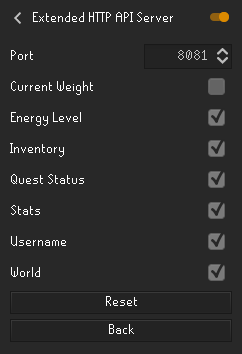
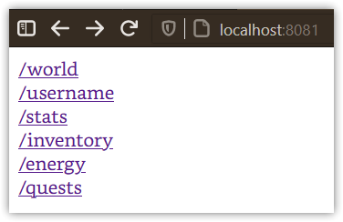
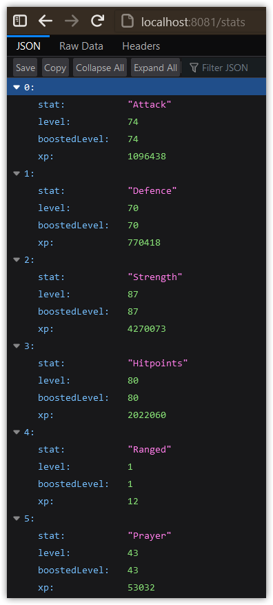
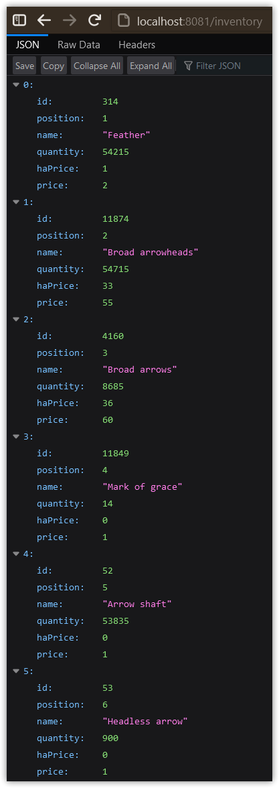

# Extended HTTP API Plugin

Based on [Adam-'s HTTP Server Plugin](https://github.com/Adam-/runelite-plugins/tree/http-plugin)

Exposes some more endpoints for access to various data.

Settings to change port, and enable/disable various endpoints 

Base landing page, with links to the enabled endpoints 

Exposed stats 

List of inventory items 

